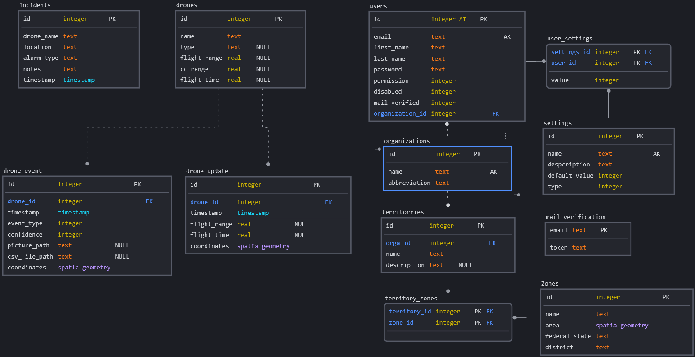

<h1 align="center">Waldbrandprävention Backend</h1>
<p align="center">   
    
</p>

<div align="center">

[](https://github.com/waldbrandpraevention/backend/actions/workflows/Pylint.yml)


[](https://www.codefactor.io/repository/github/waldbrandpraevention/backend/issues/main)


<p align="center">   
    
</p>

</div>

## Installation

 ---


  Um die vollständige Anwendung zu installieren, bitte die detaillierte [Readme im `waldbrandpraevention/frontend` Repo](https://github.com/waldbrandpraevention/frontend#readme) beachten.

--- 


## Development
#### Vorrausetzungen
- Python 3.10+
- https://github.com/tensorflow/models/blob/master/research/object_detection/g3doc/tf2.md

*Anleitung getestet auf WSL/Ubuntu.*

[ 1 ] 
```
git clone https://github.com/waldbrandpraevention/backend.git
```
[ 2 ] 
```
cd waldbrandpraevention/backend
```
[ 3 ] 
```
pip install -r requirements.txt
```
[ 4 ] 
```
pip install python-dotenv
```
[ 5 ] 

 Spatialite installieren
https://www.gaia-gis.it/fossil/libspatialite/home
##### Windows
Wir empfehlen ihnen hier ein WSL zu nutzen.
##### Ubuntu / Debian / WSL
```
sudo apt install libspatialite7 libspatialite-dev libsqlite3-mod-spatialite
```
##### MacOS (nicht getestet)
```
brew install sqlite3 libspatialite
```
##### Alpine
```
apk add libspatialite=5.0.1-r5
```

[ 6 ]
TF2 Object detection installieren
https://github.com/tensorflow/models/blob/master/research/object_detection/g3doc/tf2.md

[ 7 ] 

Bei Linux/MacOS muss noch in der `demo.env` die `\\` auf `/` geändert werden.

Eventuell vorhandene Datenbank löschen `rm -f testing.db`

[ 8 ]
##### Umgebungsvariablen setzen
Benennung der Datenbankdatei und ihr Pfad.
```
DB_PATH = 'data/testing.db'
DB_BACKUP_PATH = 'data/backuptest.db'
```
Erstellen von Demo Accounts.
Im folgenden gilt:
Ist eine Varbiable nicht gesetzt, so wird das entsprechende Element nicht erstellt.
Will man nur einen User und eine Orga erstellen und dieser nur einen District zuordnen, so setzt man die Überflüssigen Variablen nicht.
```
ADMIN_MAIL = 'admin@kiwa.tech'
ADMIN_MAIL_TWO = 'ka@kiwa.tech'
ADMIN_PASSWORD = 'adminkiwa'
ADMIN_ORGANIZATION = 'KIWA'
ADMIN_ORGANIZATION_TWO = 'KIKA'
```
Für Demo Drohnenevents und -updates, können die folgenden Variablen gesetzt werden.
(unabhängig von der Simulation).
```
DEMO_LONG = '12.68895149'
DEMO_LAT = '52.07454738'
```
Mithilfe der folgenden Variablen, werden die Zonendaten gesetzt.
Unter (https://data.opendatasoft.com/explore/dataset/georef-germany-gemeinde%40public/table)
können geojson Files erstellt werden, die anschließend in die Datenbank eingelesen werden.
District entspricht "Kreis name" im geojson.
Sofern gesetzt, werden DEMO_DISTRICT (und DEMO_DISTRICT_TWO) der ADMIN_ORGANIZATION zugeordnet.
DEMO_DISTRICT_THREE wird ADMIN_ORGANIZATION_TWO zugeordnet, sofern beides gesetzt wurde.
```
GEOJSON_PATH = 'data/zone_data.geojson' 
DEMO_DISTRICT = 'Landkreis Potsdam-Mittelmark'
DEMO_DISTRICT_TWO = 'Landkreis Teltow-Fläming'
DEMO_DISTRICT_THREE = 'Landkreis Karlsruhe'
```

```
DOMAIN_API = 'http://127.0.0.1:8000'
EVENT_PATH = 'data/events' 
DRONE_FEEDBACK_PATH = 'data/feedback'
```
Simulationsspezifische Variablen.
```
RUN_SIMULATION = 'True'
SIMULATION_EVENT_CHANCE = '0.1'
SIMULATION_UPDATE_FREQUENCY = '10'
SIMULATION_DRONE_SPEED_MIN = '0.0001'
SIMULATION_DRONE_SPEED_MAX = '0.0002'
```

[ 9 ]
```
uvicorn main:app --reload --env-file demo.env
```
Backend läuft auf http://localhost:8000<br>
API Documentation auf http://localhost:8000/docs

#### Tools

Spatialite GUI Editor https://www.gaia-gis.it/fossil/spatialite_gui/index
